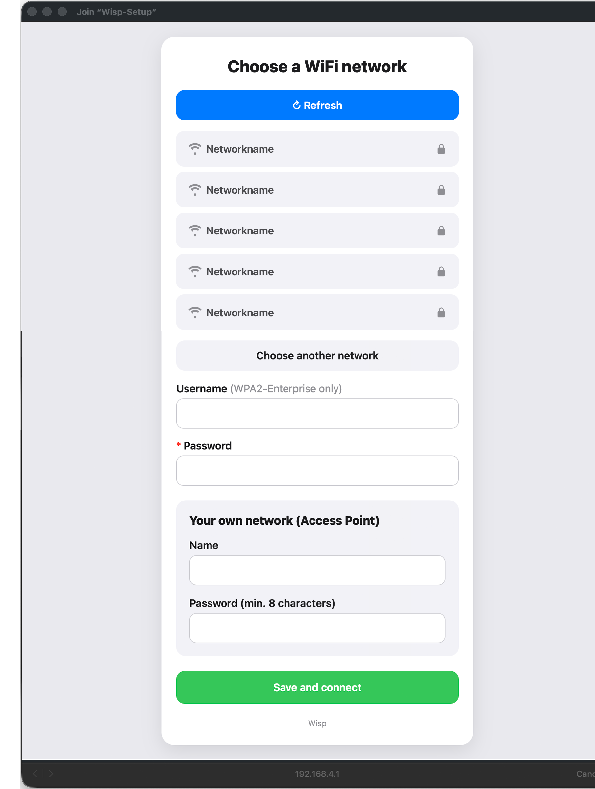
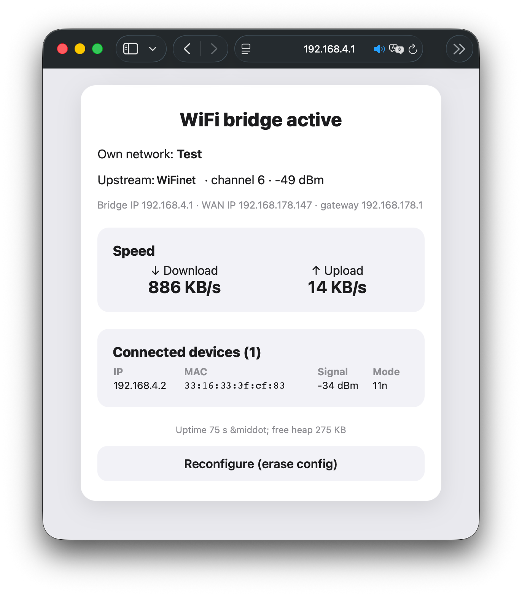

# Wisp


**Wisp is a tiny WiFi bridge (range extender / repeater) for ESP32.** It joins a
WiFi network you already have and re-shares that internet over its *own* WiFi
network. Devices like a Raspberry Pi and a laptop connect to Wisp instead of to
your router, get online, and can talk to each other on one small private
network.

You set everything up from your phone or laptop through a web page — no
passwords are baked into the code.

> [!IMPORTANT]
> Only use Wisp with a network you are **allowed** to share: your own phone
> hotspot, your home WiFi, or an approved guest network. Putting Wisp on a
> managed/company network you are not permitted to share from makes it a "rogue
> access point", which is against the rules of most such networks.

---

## Features

- **Web-based setup** — a captive portal scans for networks and lets you pick
  the upstream WiFi and name your own access point. Nothing is hard-coded.
- **WPA2-Personal and WPA2-Enterprise upstream** — connect to a normal
  password-protected network, or to an enterprise network (PEAP/MSCHAPv2) with a
  username and password.
- **Live status page** at `http://192.168.4.1` — upstream signal/channel, the
  bridge's IP addresses, real up/download throughput, and a table of connected
  devices (IP, MAC, signal, WiFi mode).
- **RGB status LED** — tells you the mode at a glance.
- **Hardware and web reset** — wipe the configuration with the BOOT button or
  from the status page.
- **NAPT routing** so all your devices share one internet connection and sit on
  one private subnet.

---

## What you need

**Hardware**

- A supported **ESP32 board** with WiFi — an **ESP32-C6 Super Mini** is the
  reference board (see [Supported boards](#supported-boards) for the full list).
- A **USB cable** that can transfer data (not a charge-only cable).
- The WiFi network you want to share, plus its credentials.
- The devices you want to bring online (e.g. a Raspberry Pi and a laptop).

**Software (on your computer)**

- **ESP-IDF v5.3 or newer** — Espressif's official toolkit. Installing it is the
  one-time setup; see Step 1 below.

On boards with native USB (C3, C6, S2, S3) you do **not** need a separate USB
driver. Classic ESP32 boards usually need a CP210x or CH340 driver.

---

## What the LED tells you

The on-board RGB LED (WS2812, GPIO8 on the C3/C6 Super Mini) is your status
display:

| Color                | Meaning                                       |
| -------------------- | --------------------------------------------- |
| Blue (steady)        | Setup mode — the configuration page is open   |
| Orange (blinking)    | Connecting to your WiFi network               |
| Green (steady)       | Connected — internet is being shared          |
| Red (blinking)       | Lost the connection — retrying automatically  |

---

## Step 1 — Install ESP-IDF (one time)

ESP-IDF is the toolchain that turns this code into firmware. Pick the easiest
option for you:

- **Beginner-friendly (recommended):** install the **ESP-IDF extension for VS
  Code**. Open VS Code, go to Extensions, search "ESP-IDF", install it, then run
  the "Configure ESP-IDF Extension" wizard and choose version **5.4** (or newer).
  Guide: <https://github.com/espressif/vscode-esp-idf-extension>
- **Windows installer:** download the ESP-IDF Tools Installer from
  <https://dl.espressif.com/dl/esp-idf/> and follow the prompts.
- **macOS / Linux command line:** follow
  <https://docs.espressif.com/projects/esp-idf/en/stable/esp32c6/get-started/>
- **Docker (no install):** `docker run -it -v $PWD:/project -w /project
  espressif/idf:v5.4.2` gives you a ready-made ESP-IDF shell.

After installing, open the **ESP-IDF terminal** (the VS Code extension provides
one, or run `export.sh` / `export.bat` from your IDF install). When
`idf.py --version` prints a version, you're ready.

---

## Step 2 — Get the code

```sh
git clone https://github.com/AchimPieters/wisp.git
cd wisp
```

(Or download the ZIP from the green **Code** button on GitHub and unzip it.)

---

## Step 3 — Build and flash

Plug the board into your computer, then run (replace the target with your chip):

```sh
idf.py set-target esp32c6
idf.py build
idf.py -p <PORT> flash monitor
```

What each line does:

- `set-target esp32c6` — tells ESP-IDF which chip you're building for (only
  needed once; see [Supported boards](#supported-boards) for valid targets).
- `build` — compiles the firmware. The first build also downloads the
  `led_strip` component automatically.
- `flash monitor` — uploads the firmware and then shows the board's log output.

Replace `<PORT>` with your board's port:

- **Linux:** `/dev/ttyACM0` (native USB) or `/dev/ttyUSB0` (USB-UART)
- **macOS:** `/dev/cu.usbmodem…` (run `ls /dev/cu.*` to find it)
- **Windows:** `COM3`, `COM4`, … (check Device Manager, "Ports")

> Tip: in the VS Code extension you can skip the commands and use the bottom-bar
> buttons: select target, then Build, Flash, Monitor.

To leave the monitor, press **Ctrl+]**.

---

## Step 4 — First-time setup (the web page)



*The setup portal, served at `http://192.168.4.1` when the LED is blue. It scans
for nearby networks (tap **Refresh** to rescan), lets you pick the upstream WiFi
— with an optional **Username** for WPA2-Enterprise — and name **your own
network (Access Point)**. **Save and connect** stores everything and reboots the
board.*

1. Power the board. The LED turns **blue** — it has started a setup network.
2. On your phone or laptop, open WiFi settings and connect to **`Wisp-Setup`**
   (password: **`wispsetup`**).
3. A configuration page should pop up automatically. If it doesn't, open a
   browser and go to **`http://192.168.4.1`**.
4. Under **Choose a WiFi network** the nearby networks appear. Tap the one you
   want to share from. (No network shown? Tap **Refresh** to scan again, or
   **Choose another network** to type a hidden name.)
5. **WPA2-Enterprise only:** fill in the **Username**. Leave it empty for a
   normal password-protected (WPA2-Personal) network.
6. Type that network's **Password**.
7. Under **Your own network (Access Point)** choose a **Name** and **Password**
   (min. 8 characters) for the new network Wisp will create.
8. Tap **Save and connect**. The board saves and reboots.

After the reboot the LED goes **orange** (connecting) and then **green** when
it's online and sharing internet.

---

## Step 5 — Connect your devices

On your Raspberry Pi, laptop, etc., connect to the network name and password you
chose in step 7. They now have internet through Wisp, and they're all on the
`192.168.4.x` network, so they can reach each other directly (SSH, file
transfer, a web interface, and so on). Wisp itself is always at `192.168.4.1`.

---

## The status page

Open `http://192.168.4.1` from a device connected to Wisp to see a live
dashboard (auto-refreshing every 2 s):

- Upstream network: SSID, channel and signal strength.
- Bridge IP, WAN IP and gateway.
- Real **download / upload** throughput.
- A table of connected devices: IP, MAC, signal and WiFi mode.
- Uptime and free memory.
- A **Reconfigure (erase config)** button to start over.



*The live dashboard in operational mode. Here Wisp ("Own network: Test") is
connected upstream to "WiFinet" on channel 6 at −49 dBm, routing one client
(`192.168.4.2`) at 886 KB/s down / 14 KB/s up. Throughput, the device list and
the system line all refresh every 2 seconds.*

---

## Resetting (wipe the configuration)

- **From the web page:** go to `http://192.168.4.1` and click **Reconfigure
  (erase config)**.
- **With the button:** power the board on, then press and hold the **BOOT**
  button within about 1.5 seconds. The configuration is erased and Wisp returns
  to setup mode (blue LED). The serial log shows
  `Reset button held -> configuration erased`.
  *Note:* the BOOT pin (GPIO9 on C3/C6) is a "strapping" pin, so don't hold it at
  the exact moment of power-on; press it just after the board starts.

---

## Supported boards

Wisp needs WiFi, so it runs on the WiFi-capable ESP32 family. Build for your
chip with `idf.py set-target <target>`.

| Chip / board            | Target      | Notes                                                            |
| ----------------------- | ----------- | ---------------------------------------------------------------- |
| **ESP32-C6 Super Mini** | `esp32c6`   | **Reference board.** WiFi 6, native USB, RGB LED on GPIO8, BOOT on GPIO9 — works out of the box. |
| **ESP32-C3 Super Mini** | `esp32c3`   | **Best budget option.** Same LED/BOOT pinout as the C6, native USB. Works out of the box. |
| ESP32-S3                | `esp32s3`   | Dual-core, more RAM/flash, good throughput. Set `LED_GPIO` (often 48) and `RESET_GPIO` for your board. |
| ESP32-S2                | `esp32s2`   | Single-core, native USB. Adjust `LED_GPIO` / `RESET_GPIO`.       |
| ESP32 (classic)         | `esp32`     | Dual-core, WiFi 4. BOOT is GPIO0 → set `RESET_GPIO 0`; most boards have no addressable LED. Needs a USB-UART driver. |
| ESP32-C2 (ESP8684)      | `esp32c2`   | Works for WPA2-Personal, but RAM is tight; WPA2-Enterprise may not fit. |

**Not supported:** ESP32-H2 (no WiFi, only 802.15.4/BLE) and ESP32-P4 (no
built-in WiFi). These cannot act as a WiFi bridge.

**Recommended:** the **ESP32-C6 Super Mini** (WiFi 6, zero configuration) or the
cheaper **ESP32-C3 Super Mini**. For the highest throughput, a dual-core
**ESP32-S3** board.

When porting to a different board, check two pins:

- `LED_GPIO` in `main/status_led.c` (default `8`) — the WS2812 data pin.
- `RESET_GPIO` in `main/main.c` (default `9`) — the BOOT button (use `0` on
  classic ESP32 / many S3 boards).

CI compile-tests `esp32`, `esp32s2`, `esp32s3`, `esp32c3` and `esp32c6` on every
push (see `.github/workflows/build.yml`).

---

## Troubleshooting

| Problem | Fix |
| --- | --- |
| No port shows up when flashing | Use a data-capable USB cable; try another port. Native-USB chips (C3/C6/S2/S3) need no driver; classic ESP32 needs a CP210x/CH340 driver. |
| `idf.py: command not found` | Open the ESP-IDF terminal first (run `export.sh` / `export.bat`, or use the VS Code extension's terminal). |
| Build fails on `led_strip` | You need ESP-IDF **5.x** and an internet connection on the first build (the component is downloaded then). |
| `Wisp-Setup` network doesn't appear | Wait a few seconds after power-on; the LED must be blue. If not, re-flash. |
| Connected to my AP but no internet | Make sure the LED is **green**. If names don't resolve it's usually DNS — reboot once. |
| Repeated `Upstream lost (reason=…)` in the log | The upstream credentials are wrong or the network is out of range. For WPA2-Enterprise, double-check the username/password. |
| LED stays off or shows wrong colors | Your board may use a different LED pin. Change `LED_GPIO` in `main/status_led.c`. |
| The board runs warm | Normal: a bridge keeps the radio fully on (power save is disabled so the access point stays responsive). Use a good power supply; a small heatsink helps. |
| Slow / video stutters | An ESP as a router has limited throughput. Great for management and light browsing, not for heavy video. |

---

## How it works

Wisp runs the WiFi radio in access-point + station mode at the same time. The
station side joins your upstream network; the access-point side serves your
devices. NAPT (the same NAT a home router does) routes traffic between the two.
On first boot — or after a reset — it instead opens a captive portal (a small
web server plus a DNS trick that makes the setup page pop up) so you can enter
your settings, which are saved in flash (NVS).

Power save is turned off (`WIFI_PS_NONE`): in combined AP+STA mode, modem sleep
makes the access point miss the WPA2 4-way handshake, so clients fail to join.
Keeping the radio awake is the correct trade-off for an always-on bridge (and is
why the chip runs warm).

## Project structure

```
wisp/
├── CMakeLists.txt              # top-level project file
├── sdkconfig.defaults          # enables IP forwarding + NAPT, larger app partition
├── .github/workflows/build.yml # CI: multi-target compile test on every push
└── main/
    ├── CMakeLists.txt
    ├── idf_component.yml        # pulls in espressif/led_strip
    ├── main.c                  # init, mode select, WiFi AP+STA, NAPT, reset button
    ├── config_store.c/.h       # saves/loads settings in NVS
    ├── portal.c/.h             # captive portal + live status page (web, DNS, scan, stats)
    └── status_led.c/.h         # WS2812 status indicator
```

## Things you can tweak

- **LED pin:** `LED_GPIO` in `main/status_led.c` (default 8).
- **Reset/BOOT pin:** `RESET_GPIO` in `main/main.c` (default 9; use 0 on classic ESP32).
- **LED brightness/colors:** the `set_rgb(...)` values in `main/status_led.c`.
- **Setup network name/password:** the `set_ap_config("Wisp-Setup", "wispsetup")`
  line in `main/main.c`.

## Limitations

- WPA2-Enterprise uses PEAP/MSCHAPv2 with the same value as both the outer
  (anonymous) identity and the inner username, and does not validate the server
  certificate. Networks that require a separate anonymous identity or strict
  certificate checking are not supported.
- All device-to-device traffic is relayed by the single radio; a network scan in
  setup mode can briefly stutter the portal connection.
- Throughput is limited (especially on single-core RISC-V chips); fine for
  management and light browsing, not for heavy streaming.
- WS2812 LEDs are driven over RMT; under heavy WiFi load an occasional wrong
  color flash can happen. Harmless for a status light.

## License

MIT — see [LICENSE](LICENSE). Copyright (c) 2026 Achim Pieters.
